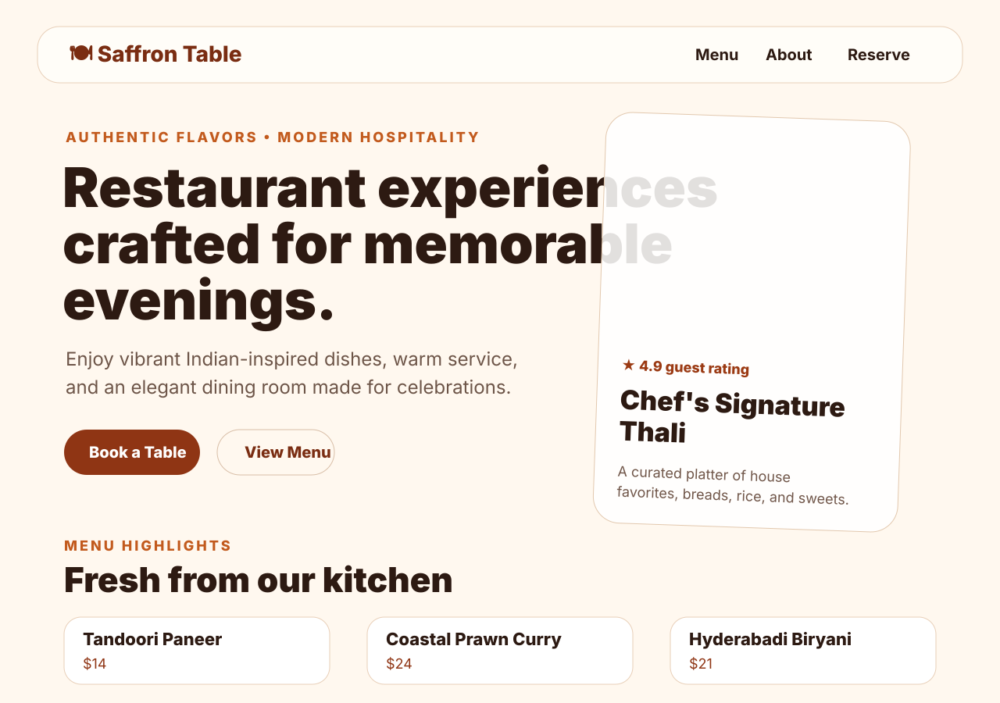

# Restaurant Frontend

A modern React + Vite restaurant landing page featuring a hero section, menu highlights, hospitality details, and reservation contact information.

## Scripts

- `npm run dev` - start the React development server
- `npm run dev:server` - start the Node.js API server on port 5000
- `npm run build` - create a production build
- `npm run preview` - preview the production build locally
- `npm start` - start the Node.js API server
- `npm run lint` - run ESLint checks

## Backend API

- `GET /api/health` - backend health check
- `GET /api/restaurant` - restaurant contact and hours
- `GET /api/menu` - menu items
- `GET /api/reservations` - submitted reservation requests
- `POST /api/reservations` - submit a reservation with `name`, `phone`, `date`, `time`, and `guests`
